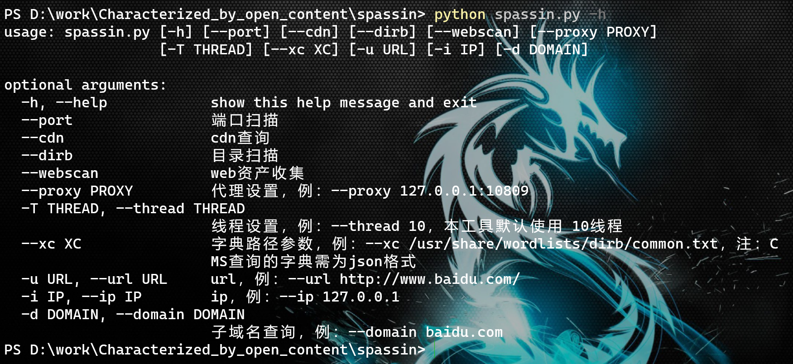
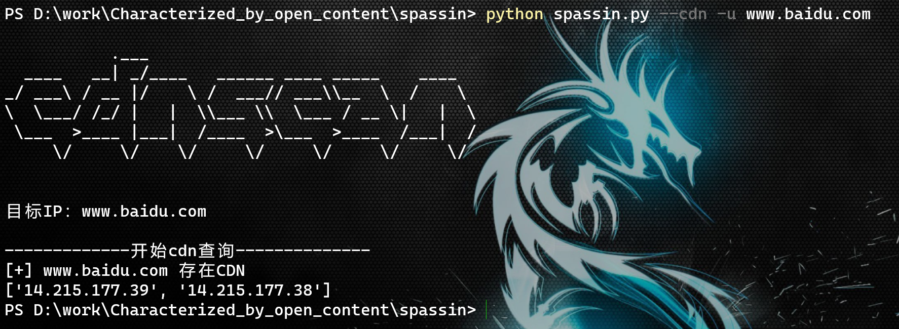
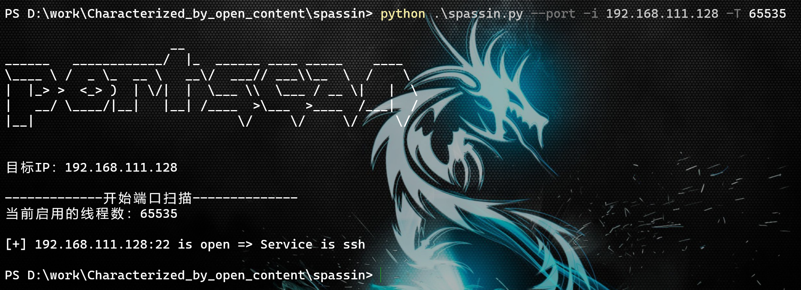
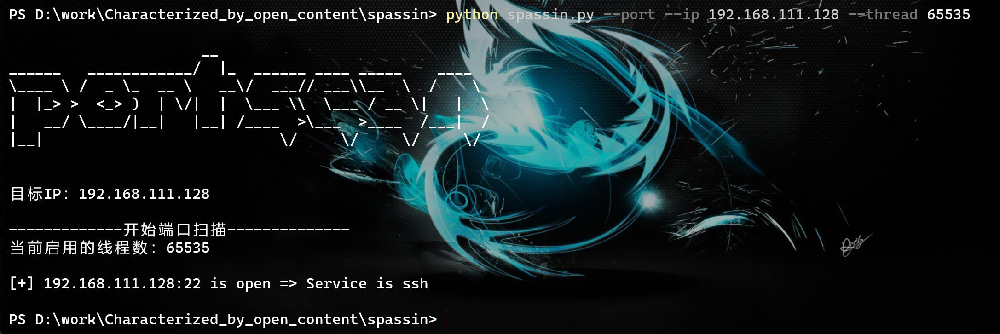
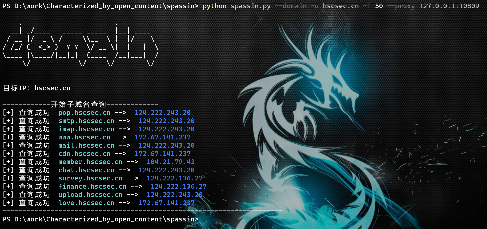
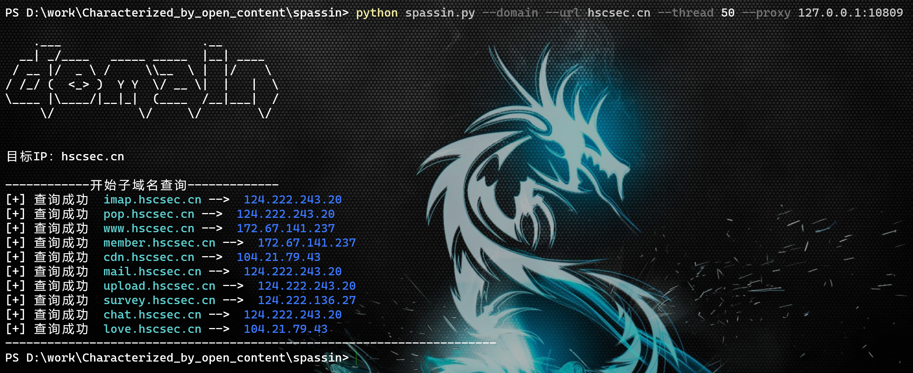

# spassin扫描工具使用说明
> 使用方法

python spassin.py -h

注：1、本程序默认线程数为 10，线程数可调，参数为：-T/--thread
   2、本程序支持设置代理，不过仅限 webscan、domain参数

> cdn查询

* python spassin.py --cdn -u www.baidu.com

* python spassin.py --cdn --url www.baidu.com

> 端口扫描

* python spassin.py --port -i 192.168.111.128 -T 65535

* python spassin.py --port --ip 192.168.111.128 --thread 65535

> web资产收集

* python spassin.py --webscan -u www.hscsec.cn -T 50

* python spassin.py --webscan --url www.hscsec.cn --thread 50 --proxy 127.0.0.1:10809

**注：webscan可以通过 proxy参数 进行本地全局代理的配置**

> 子域名查询

* python spassin.py --domain -u hscsec.cn -T 50 --proxy 127.0.0.1:10809 

* python spassin.py --domain --url hscsec.cn --thread 50 --proxy 127.0.0.1:10809

